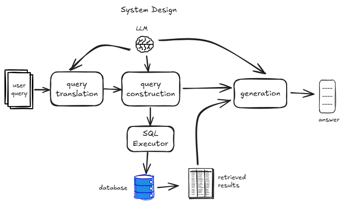

# Bookstore RAG Application

## Overview

This project is a Retrieval-Augmented Generation (RAG) application for a bookstore. It allows users to ask questions in natural language about the bookstore's inventory, and it uses a Large Language Model (LLM) to translate these questions into SQL queries, retrieve the relevant information from a PostgreSQL database, and provide a user-friendly answer.

## Features

- **Natural Language Queries**: Ask questions about books in plain English.
- **SQL Generation**: Automatically converts natural language questions into SQL queries.
- **Dockerized**: The entire application and database can be run with a single command using Docker Compose.
- **Extensible**: The system can be extended to support other models and data sources.
- **Evaluation Framework**: Includes a framework for evaluating the performance of the RAG system.

## Technology Stack

- **Frontend**: HTML, CSS, JavaScript
- **Backend**: Python, FastAPI
- **Database**: PostgreSQL
- **Containerization**: Docker, Docker Compose
- **LLM**: Google Gemini
- **Orchestration**: LangChain
- **Tracing and Monitoring**: LangSmith (optional but highly recommended)

## Getting Started

### Prerequisites

- Docker
- Docker Compose
- Python 3.9+
- `pip`

### Configuration

Before running the application, you need to configure your environment variables. Create a file named `.env` in the root of the project.

```
# .env

# Database Configuration
DB_HOST=localhost
DB_USER=user
DB_PASSWORD=password
DB_NAME=bookstore

# Google API Key
GOOGLE_API_KEY=your_google_api_key

# LangSmith Tracing (Optional)
LANGSMITH_TRACING=false
LANGSMITH_ENDPOINT="https://api.smith.langchain.com"
LANGSMITH_PROJECT=your_langsmith_project
LANGSMITH_API_KEY=your_langsmith_api_key
```

**Note on `DB_HOST`**: The value of `DB_HOST` depends on how you run the application. See the instructions below.

### Running the Application

#### Option 1: Docker (Recommended)

This is the recommended way to run the application. It will build the application image and run both the application and the database in Docker containers.

1.  **Configure `.env` for Docker**:
    In your `.env` file, either **comment out or remove** the `DB_HOST` variable. The `docker-compose.yml` file will automatically set it to `db`, which is the correct hostname for the container network.

2.  **Build and run the application**:
    ```bash
    docker-compose up --build
    ```
    The `--build` flag is only necessary the first time you run the application or if you have made changes to the code. The application will be available at `http://localhost:8000`. Note that the initial response may take some time due to model rate limits.

3.  **Stop and clean up**:
    When you are finished, use the following command to stop the containers and remove the database data:
    ```bash
    docker-compose down --volumes
    ```

#### Option 2: Local Development

This approach runs the Python application directly on your host machine, but it still uses Docker to run the PostgreSQL database.

1.  **Install Python dependencies**:
    ```bash
    pip install -r requirements.txt
    ```

2.  **Configure `.env` for Local Development**:
    In your `.env` file, make sure `DB_HOST` is set to `localhost`:
    ```
    DB_HOST=localhost
    ```

3.  **Start the database**:
    ```bash
    docker-compose up -d db
    ```
    This will start only the `db` service in the background.

4.  **Run the application**:
    ```bash
    python app.py
    ```


## System Architecture

The system enables natural language interaction with a database by combining query translation, SQL generation, and language model reasoning.

1. **User Query**
   The process begins with a natural language query from the user (e.g., *“Show me the books published by 'Amazon' that have a rating of 4.8 or higher.”*).

2. **Query Translation**
   The system uses an LLM to interpret the user’s intent by identifying entities and conditions to ensure the query is semantically understood and to remove any ambiguities.

3. **Query Construction**
   The system uses an LLM by giving it a persona of an expert SQL operator via instructions to convert the interpreted intent into an executable SQL query. For example, it might generate a `SELECT` statement that groups books by genre. Additionally, the LLM is also given the schema of the database to ensure the query is valid. In our case, since we are dealing with only two tables, dumping the schema into the LLM's context is acceptable. In cases where the schema is large, we would need to store it in a vector store and let the model dynamically select the relevant schema based on the user's query.

4. **SQL Executor**
   The generated SQL query is executed against the database, which ensures safe execution. The executor fetches structured results, such as tables or numerical values.

5. **Generation**
   Since raw SQL results are not user-friendly, the LLM reformulates the results into natural language. Here, a different persona based on the end-user experience is given to the LLM to generate a more user-friendly response. In this case, the persona is a helpful assistant that answers user inquiries about the books available in the bookstore.

6. **Answer**
   The final answer is presented to the user in a clear, natural language form.

<p align="center">
  
</p>

## Evaluation

### Eval Data
To evaluate the RAG system, a set of question-and-answer pairs were synthetically created and manually verified for correctness. The goal is to have faithful coverage over the types of questions that can be asked of the system. The questions are classified into the following types:

-   **Single-hop**: Simple retrieval look-up questions.
-   **Multi-hop**: Questions that require combining multiple facts across tables or rows.
-   **Faithfulness**: Questions that require the system to provide a faithful answer and not hallucinate information.
-   **Aggregation**: Questions that require an aggregated answer (e.g., COUNT, GROUP BY).

### Evaluators
We use an LLM as a judge to evaluate the system's responses against the reference answers. We focus on two main aspects:

1.  **Correctness**: Measures how similar the generated answer is to the ground-truth answer.
2.  **Relevance**: Measures how relevant the generated answer is to the question.

The prompts for correctness and relevance are found in `evaluation_prompts.py`. To run the system evaluation, use the following command:

```bash
python evaluation.py
```

